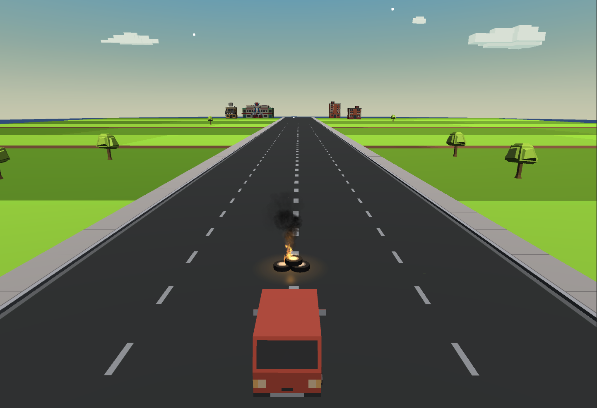
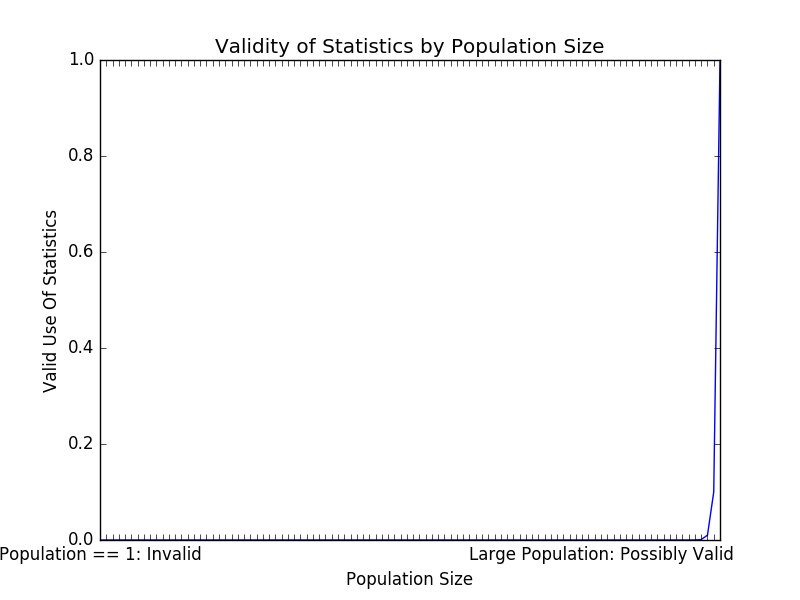
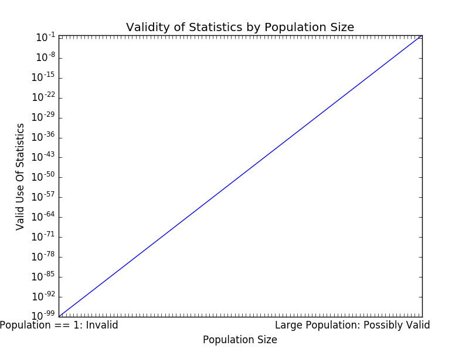

# Statistics Are Invalid When Population Size Is One

This is a meant as a logical proof that statistics are invalid when the population size is one.

My assertion is that when the population size is one, all information is local information, and no external population statistical information can determine anything about this single unit of population.

Let's start with a problem example.  Initial Scenario:

1. You are in a car, in the center of a wide road, with no obstacles or other cars around you, and no turns or other decisions to be made for a long time.
2. You are going straight, there is no reason to change inputs.  The initial situation is stable, and without obstacles.
3. No other options are available, such as "Slow down", "Stop" or "Transform and Fly Away".  Only "Turn Right" and "Turn Left" are available options.

Problem Introduction:

1. From the Initial Scenario...
2. An obstable is introduced ahead of the car's path.
3. There are 2 options available in this scenario:  Turn Right or Turn Left
4. Can you determine, through use of statistics, for this given problem, whether one should statistically Turn Right or Turn Left?
5. Given unlimited resources, could you design an experiment and create a set of statistical data that would allow you to determine whether you should statistically Turns Right or Turn Left in this specific problem case?

My Conclusion:

1. Because the data available is local to the single problem case (an obstacle in front of your car, right now), all the data is local to the situation.
2. No amount of data about other situations will tell you whether you should Turn Right or Turn Left, because that information would be based on different situational data.
3. Only this exactly single (one) case will have the exact data that we need to determine a correct action.
4. The only data relevant to making this decision will come from the local data, which is:  If the obstacle is closer to the Right Side of the car, you should Turn Left to better avoid it, and conversely if the obstacle is closer to the Left Side of the car, you should Turn Right to better avoid it.
5. No amount of non-local data that could be analyzed would be able to give anything but pure chance as to the location of the obstacle in relation to your car, to determine which direction is best to avoid the obstacle.

My assumption is that this type of transition between stastics ability to be used validly would be something like an exponential curve at the point where the population becomes large enough to be statistically signficant.  This may actually be more like an S-curve though.  I will leave that as an exercise for other people, but here are some simple example exponential graphs just to add a visual-style explanation of this validity curve.

Normal Y-Scaling:

Logarithmic Y-Scaling:

